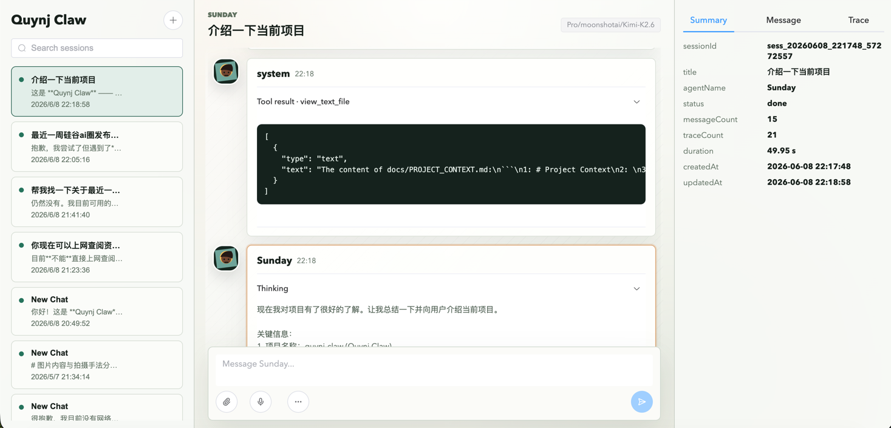
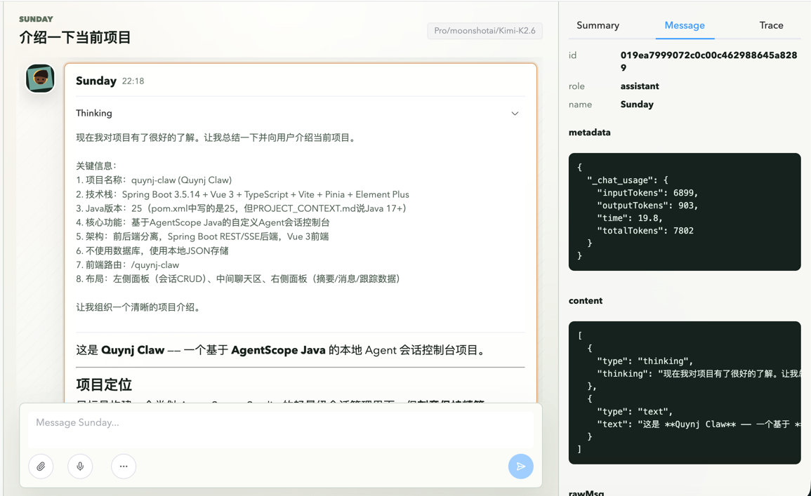
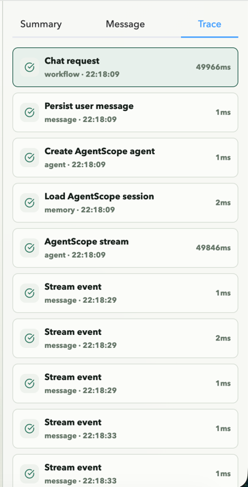

# Quynj Claw

> 本地 Agent 会话控制台 — 基于 AgentScope Java 的轻量级 AI 对话运行时

[](https://openjdk.org/)
[](https://spring.io/projects/spring-boot)
[](https://vuejs.org/)
[](https://www.typescriptlang.org/)

Quynj Claw 是一个专注于本地会话管理的 Agent 控制台，提供类 AgentScope Studio 的会话管理、实时对话和运行时追踪能力。

## 安全考虑

Quynj Claw 专注于安全的本地 Agent 开发体验，具有以下安全特性：

- **不支持 Shell 命令执行**：系统不提供直接的 Bash/Shell 工具调用能力，防止代码注入和命令执行风险
- **沙箱环境隔离**：Agent 运行在受控的 Java 虚拟机环境中，所有外部 API 调用需经过明确配置
- **人类介入机制**：关键操作（如文件写入、外部 API 调用）可通过技能配置要求人工确认
- **自定义模型支持**：支持多种模型提供商配置，包括本地 Ollama 部署，数据不离开本地环境
- **本地持久化存储**：所有会话数据、技能配置均存储在本地 `.agents` 文件夹，无云端同步

> 注意：虽然系统设计了多层安全机制，但仍建议在生产环境中使用前充分测试技能文件和模型输出内容。

## 项目亮点

- **零数据库依赖**：完全基于本地 JSON 存储，无需配置任何数据库
- **AgentScope 深度集成**：原生集成 AgentScope Java 的 ReActAgent、AutoContextMemory 和 JsonSession
- **实时 SSE 推送**：支持消息增量流式传输和会话状态实时更新
- **运行时追踪**：完整的控制台级别运行时链路追踪，可视化展示 Agent 执行过程
- **本地技能扩展**：支持通过 Markdown 技能文件快速扩展 Agent 能力
- **多模型支持**：支持 DashScope、OpenAI 兼容接口、Ollama 等多种模型提供商

## 技术栈

### 后端
- Java 25
- Spring Boot 3.5.14
- AgentScope Java 1.0.11
- Maven

### 前端
- Vue 3.5
- TypeScript 5.7
- Vite 6.2
- Pinia 状态管理
- Element Plus UI 组件库
- Bun 包管理

## 主要功能

### 会话管理
- 创建、重命名、删除会话
- 会话搜索和状态预览
- 每个会话独立的 UI 存储和 AgentScope 会话状态

### 智能对话
- 支持文本和图片附件
- 浏览器语音输入（当可用时）
- Markdown 渲染
- 消息角色显示（用户显示为 "You"，助手显示为配置的 Agent 名称）
- 头像随机化和本地持久化

### 内容展示
- 三栏布局：会话列表 / 对话区域 / 数据面板
- 消息详情查看
- 会话摘要展示
- 运行时追踪时间线

### Agent 集成
- ReActAgent 自动创建
- AutoContextMemory 上下文管理（自动压缩和上下文重载）
- 内置 Java 工具（计算器、日期时间、系统信息、文件操作）
- 项目本地技能加载

## 快速开始

### 环境要求
- JDK 25+
- Maven
- Bun（前端包管理）

### 安装步骤

1. **克隆仓库**
```bash
git clone https://github.com/quynj/quynj-claw.git
cd quynj-claw
```

2. **配置模型提供商**

编辑 `src/main/resources/application.yml`，根据需要选择模型提供商：

```yaml
quynj-claw:
  model:
    provider: openai  # 可选: dashscope, openai, ollama
    name: qwen2.5-7b-instruct
    api-key: your-api-key
    base-url: https://api.openai.com/v1
```

或通过环境变量配置：
```bash
export OPENAI_API_KEY=your-api-key
export MODEL=qwen2.5-7b-instruct
export OPENAI_BASE_URL=https://api.openai.com/v1
```

3. **启动后端**
```bash
mvn clean install
mvn spring-boot:run
```

4. **安装前端依赖并启动**
```bash
cd frontend
bun install
bun run dev
```

5. **访问应用**

打开浏览器访问：`http://localhost:8080/quynj-claw`

## 配置说明

### 模型提供商配置

#### OpenAI 兼容接口
```yaml
model:
  provider: openai
  name: gpt-4
  api-key: ${OPENAI_API_KEY}
  base-url: ${OPENAI_BASE_URL:https://api.openai.com/v1}
```

#### DashScope
```yaml
model:
  provider: dashscope
  name: qwen-plus
  api-key: ${DASHSCOPE_API_KEY}
```

#### Ollama
```yaml
model:
  provider: ollama
  name: llama3
  base-url: ${OLLAMA_BASE_URL:http://localhost:11434}
```

### 内存配置

```yaml
memory:
  type: auto-context
  max-context-tokens: 8192
  fallback-to-in-memory: true
```

### 存储路径

所有运行时数据存储在项目根目录的 `.agents` 文件夹下：

```
.agents/
├── ui-store/           # UI 投影存储
│   ├── sessions.json
│   ├── messages/
│   ├── summaries/
│   └── traces/
├── agentscope-sessions/ # AgentScope 会话状态
└── skills/            # 项目本地技能
```

## 内置技能

Quynj Claw 预置了以下技能（位于 `.agents/skills/`）：

- **nano-memory**：持久化本地记忆管理
- **conventional-commit**：自动化提交信息生成
- **quynj-claw-agent**：Quynj Claw 运行时操作
- **skills-creator**：项目本地技能创建和更新

## API 端点

### 会话管理
- `GET /api/sessions` - 获取会话列表
- `POST /api/sessions` - 创建新会话
- `PATCH /api/sessions/{sessionId}` - 更新会话
- `DELETE /api/sessions/{sessionId}` - 删除会话
- `GET /api/sessions/{sessionId}/summary` - 获取会话摘要

### 消息交互
- `GET /api/sessions/{sessionId}/messages` - 获取消息列表
- `POST /api/sessions/{sessionId}/messages` - 发送消息
- `GET /api/messages/{messageId}` - 获取消息详情

### 运行时追踪
- `GET /api/sessions/{sessionId}/traces` - 获取追踪列表
- `GET /api/traces/{traceId}` - 获取追踪详情

### 实时事件
- `GET /api/sessions/{sessionId}/events` - SSE 事件流

### SSE 事件类型
- `message.created` - 消息创建
- `message.delta` - 消息增量更新
- `session.updated` - 会话状态更新
- `trace.created` - 追踪创建
- `trace.updated` - 追踪更新
- `error` - 错误事件

## 项目架构

```
Frontend (Vue 3 + TypeScript)
    ↓ REST / SSE
Spring Boot REST API
    ↓
AgentScope Runtime (ReActAgent + AutoContextMemory)
    ↓
Local Storage (JSON)
```

### 后端包结构
- `api` - REST 控制器和 SSE 处理
- `application` - 业务服务层
- `agentscope` - AgentScope 集成（Agent、Memory、Session）
- `store` - 本地 JSON 存储层
- `dto` - 数据传输对象
- `common` - 通用工具类

### 前端结构
- `views` - 页面视图
- `components` - Vue 组件
- `stores` - Pinia 状态管理
- `api` - HTTP/SSE 客户端
- `types` - TypeScript 类型定义

## 界面展示

### 主界面布局


三栏布局设计：左侧会话列表、中间对话区域、右侧运行时追踪面板，提供高效的工作流体验。

### 智能对话体验


支持 Markdown 渲染、消息角色标识、头像随机化，以及图片附件上传功能。

### 运行时追踪


可视化展示 Agent 执行链路，包括工具调用、模型推理等关键步骤，帮助理解和调试 Agent 行为。

## 待实现功能

### 核心功能增强
- [ ] 令牌计数统计与消耗分析
- [ ] 温度参数应用与模型调优
- [ ] 多 Agent 协作支持
- [ ] 会话导出/导入功能（JSON 格式）
- [ ] 技能市场与技能分享机制

### 安全与权限
- [ ] 技能权限细粒度控制
- [ ] 外部 API 调用白名单机制
- [ ] 敏感操作审计日志
- [ ] 用户角色与访问控制

### 前端优化
- [ ] 消息密度/紧凑模式切换
- [ ] 时间戳显示格式配置
- [ ] 主题切换（深色/浅色）
- [ ] 错误状态展示优化
- [ ] 前端自动化测试
- [ ] 响应式移动端适配

### AgentScope 集成
- [ ] AutoContext 调优参数配置化
- [ ] AgentScope 官方遥测/OpenTelemetry span 映射
- [ ] 确认并更新最新 AgentScope Java API 使用方式
- [ ] 完善内容块映射，支持更多消息类型
- [ ] Token 级别增量流式传输
- [ ] 支持流式图像生成与多模态交互

## 开发指南

### 后端开发
```bash
# 编译
mvn compile

# 运行测试
mvn test

# 启动应用
mvn spring-boot:run
```

### 前端开发
```bash
cd frontend

# 安装依赖
bun install

# 开发模式
bun run dev

# 构建生产版本
bun run build
```

## 贡献指南

欢迎贡献！请遵循以下步骤：

1. Fork 本仓库
2. 创建特性分支 (`git checkout -b feature/AmazingFeature`)
3. 提交更改 (`git commit -m 'Add some AmazingFeature'`)
4. 推送到分支 (`git push origin feature/AmazingFeature`)
5. 开启 Pull Request

## 许可证

本项目采用 MIT 许可证 - 详见 LICENSE 文件

## 参考资源

- [AgentScope Java 文档](https://java.agentscope.io/zh/intro.html)
- [AgentScope Java GitHub](https://github.com/agentscope-ai/agentscope-java)
- [AgentScope Studio](https://github.com/agentscope-ai/agentscope-studio)

## 联系方式

- 项目主页: [GitHub](https://github.com/quynj/quynj-claw)
- 问题反馈: [Issues](https://github.com/quynj/quynj-claw/issues)

---

Made with ❤️ by Quynj